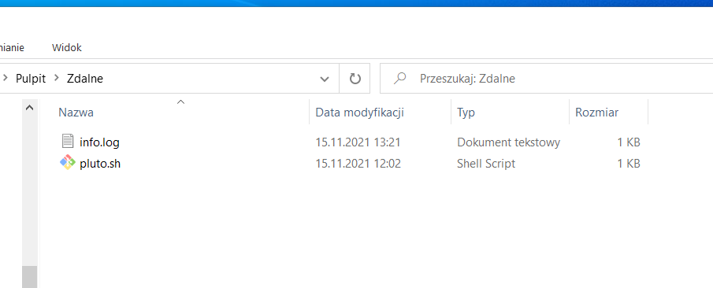

# Sprawozdanie z przedmiotu "Programowanie w chmurze obliczeniowej" - Lab. Wolumeny 
W sprawozdaniu zostały wykonane wszystkie ćwiczenia obwiązkowe. 

>link Github: https://github.com/Bartistero/lab-wolumeny                                  
>link DockerHub: https://hub.docker.com/r/bartister99/lab-4

## Tabela zawartości
* [Zadanie 1,2](#Zadanie-1,2)
* [Zadanie 3](#zadanie-3)
* [Zadanie 4](#zadanie-4)
* [Zadanie 5](#zadanie-5)
* [Zadanie 6](#zadanie-6)
* [Status](#status)
* [Kontakt](#contact)

## Zadanie 1,2
W zadaniu pierwszym, utworzono skrypt bash `pluto.sh`
następnie plik `Dockerfile`, zawartość znaduje się w repozotorium. 

W celu uruchomienia należy utworzyć wolumen poleceniem 

>`docker volume create lab4`

zbudować obraz w następujący sposób: 

>`docker build --tag first .`

a następnie uruchomić kontener, montując przy tym wcześniej utworozny wolumen: 

>` docker run --rm --mount source=lab4,target=/logi first`

Aby sprawdzić czy dane zostały "zapisane" po wyłączenie kontenera, należy przejść do następującego katalogu: `/var/lib/docker/volumes/`, wymagane uprawnienie root!!

## Zadanie 3

W celu wykoanania zadania należy na systemie macierzystym (w moim przypadku windows udostępnić plik z opcjami dostępu dla wszystkich)

Następnie w systemie linux utworzyć nowy wolumen 

sprawdzamy czy w systemie macierzystym znajdują się pliki 

## Zadanie 4

UWAGA!
Ponieważ kontenery docker kończą swoją pracę w momencie wykonania zadania, do poniższych zadań użyłem, obrazu z pierwszego projektu. 

Utworzenie kontenera na podstawie ostatniego projektu, dodatkowym ograniczniem pamięci kontenera do 512MB: 

>`docker run --rm --mount source=RemoteVol,target=/var/www/localhost/htdocs -p 80:80 --name apline4 --memory="512M"  bartister99/projekt:1`

## Zadanie 5

podunkt a) został pokazany przy wykonywaniu zadania 3! (Dockerfile realizowany w tym zadaniu)

pkt b) (ograniczenie pamięci pokazane na przykładzie obrazu z poprzedniego laboratorium )

## Zadanie 6 

W celu uruchomienia cAdvisor należy wykonać następujące polenie: 
>`sudo docker run \
>   --volume=/:/rootfs:ro \
>   --volume=/var/run:/var/run:ro \
>   --volume=/sys:/sys:ro \
>   --volume=/var/lib/docker/:/var/lib/docker:ro \
>   --volume=/dev/disk/:/dev/disk:ro \
>   --publish=8080:8080 \
>   --detach=true \
>   --name=cadvisor \
>   --privileged \
>   --device=/dev/kmsg \
>   gcr.io/cadvisor/cadvisor:$VERSION
`

a nastepęnie w przeglądarce otworzyć adres `172.17.0.1:8080`, obowiązkowe mapanie portu 8080, ponieważ takie zostało ustalone w poleceniu wyżej. 

Kliknąć w zakładkę "Docker Conainers" i wybrać apline4. 

## Status
Project is: finished

## Kontakt
Created by [@Bartistero](https://github.com/Bartistero/) - feel free to contact me!
